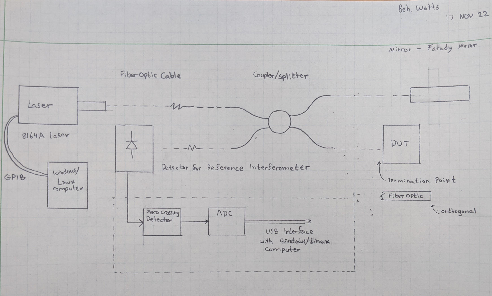

Optical Frequency Domain Reflectometry
===================================

**Optical Frequency Domain Reflectometry** (OFDR) is used for different types of sensing.

.. note::

   This project is under active development.

.. _overview:

Overview
--------

**Optical Frequency Domain Reflectometry** (OFDR) is used for different types of fiber optic sensing. 
Optical Frequency Domain Reflectometry is an integration of scientific equipment to make possible the
measuring of minute changes in the reflection of infrared laser radiation. This project will focus on the
integration of each system along with characterizing and validating our method. The approach to solve the overall
problem will consist of breaking down the project into well defined tasks. 

In order to measure the reflectivity of a given Device Under Test (DUT), a tunable laser is needed to generate a light
beam of known wavelength. The light beam is then directed to the DUT through the use of a fiber optic cable.
The reflected light is then collected by an optics detector along with a spectrum analyzer. The intensity of the
reflected light is then measured as a function of wavelength. From the data collected through the use of Python and a
Windows/Linux based computer an FFT will be computed on the data. The resulting data will show the intensity of light over
distance. We will then be able to calculate the distance between the peaks and find the width of various opaque objects
such as a microscope slide.

General Purpose Interface Bus (GPIB)
====================================

The General Purpose Interface Bus (GPIB) is a standard for connecting electronic test and measurement equipment.
It is commonly used in laboratories and manufacturing facilities to connect instruments such as oscilloscopes, multimeters,
and logic analyzers to a computer for data acquisition and analysis. GPIB is also known as HP-IB, from its original
developers, Hewlett-Packard.

Communicating with GPIB devices
----------------

To communicate with a GPIB device, you must first import the ``pyvisa`` module and create a ``ResourceManager`` object.
This object will be used to open a connection to the GPIB device. You'll need to know the GPIB address for the equipment 
you want to communicate with. The address can usually be found by navigating through the main menu of the device.

For example:

>>> import pyvisa
>>> rm = pyvisa.ResourceManager()
>>> rm.list_resources()
>>> laser = rm.open_resource('GPIB0::20::INSTR')
>>> print("Equipment ID: ",laser.query('*IDN?'))

Here are some useful commands. 

This is a link to a reference document for the `8164A Programming Guide`_.

.. _8164A Programming Guide: https://wattsjake.github.io/pdf/reference/8164A_Programming%20Guide.pdf

Optical Spectrum Analyzer (OSA)
===============================

The Optical Spectrum Analyzer (OSA) is a scientific instrument used to measure the wavelength and intensity of light. We will
be using an OSA to measure the intensity of light reflected from a DUT. The gathered data will help use to characterize the 
IR laser radiation emitted from the tunable laser.

Contents
--------

.. toctree::
   :maxdepth: 2

   overview
   about
   license
   help

